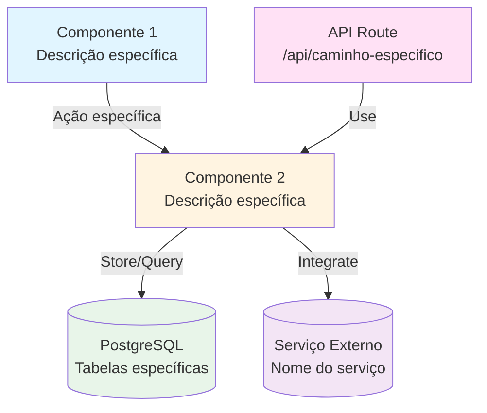

# Template: Plano de Implementação para Agentes de IA

## Instruções para Agentes de IA

Este template deve ser usado por agentes de IA para criar planos de implementação de features. Siga estas instruções:

1. **Pesquisar Primeiro**: Antes de preencher o template, pesquise no codebase para entender:
   - Padrões existentes similares
   - Estrutura de arquivos relacionada
   - Como outras features foram implementadas
   - Referências aos agents apropriados

2. **Preencher Completamente**: Substitua TODOS os marcadores `[NOME]`, `[DESCREVER]`, `[ADICIONAR]` com informações específicas e concretas. NÃO deixe marcadores vazios.

3. **JAMAIS Incluir Código**: O plano deve conter APENAS orientações descritivas sobre O QUE fazer, não COMO fazer. NÃO inclua exemplos de código TypeScript, JavaScript, bash ou qualquer outra linguagem. O executor (agente de IA ou humano) decidirá como implementar o código baseado nas orientações fornecidas.

4. **Referenciar Agents Corretamente**: Cada passo DEVE referenciar o agent apropriado. Use:
   - `agents/database-development.md` para schema/migrações
   - `agents/backend-development.md` para API routes e serviços server-side
   - `agents/frontend-development.md` para páginas e componentes UI
   - `agents/qa-agent.md` para testes
   - `agents/security-check.md` para revisão de segurança

5. **Seguir Padrões**: Sempre consulte os arquivos de referência mencionados para garantir que segue os padrões do projeto.

6. **Validar**: Após criar o plano, verifique:
   - Todas as referências aos agents estão corretas
   - Todos os caminhos de arquivos estão corretos
   - O checklist está completo e específico
   - O diagrama Mermaid está correto

---

# Plano de Implementação: [NOME DA FEATURE]

**INSTRUÇÃO**: Substitua `[NOME DA FEATURE]` com o nome descritivo da feature (ex: "Integração com Stripe", "Sistema de Notificações", "Dashboard Analytics")

[Breve descrição de 1-2 parágrafos explicando:
- O que será implementado
- Qual problema resolve
- Por que é necessário
- Benefícios principais]

**INSTRUÇÃO**: Seja específico e claro. Evite descrições genéricas.

## Visão Geral

O sistema permitirá:
- **[Funcionalidade 1]**: [Descrição breve e específica do que permite fazer]
- **[Funcionalidade 2]**: [Descrição breve e específica do que permite fazer]
- **[Funcionalidade 3]**: [Descrição breve e específica do que permite fazer]

**INSTRUÇÃO**: Liste 3-5 funcionalidades principais. Seja específico sobre o que cada uma faz. Use formato de bullet points com negrito no nome da funcionalidade.

## Referências

**INSTRUÇÃO**: Pesquise e adicione TODAS as referências relevantes:
- Documentação externa (APIs, SDKs, serviços de terceiros)
- Documentação interna do projeto
- Agents relevantes
- Arquivos de código existentes que servem como exemplo

- [Documentação Externa 1](link) - [Descrição do que contém e por que é relevante]
- [Documentação Externa 2](link) - [Descrição do que contém e por que é relevante]
- Documentação do projeto: [docs/README.md](../docs/README.md)
- Guias de agents: [agents/README.md](../agents/README.md)
- [docs/backend.md](../docs/backend.md) - Padrões de API routes
- [docs/frontend.md](../docs/frontend.md) - Padrões de componentes
- [docs/database.md](../docs/database.md) - Padrões de schema Prisma

**INSTRUÇÃO**: Adicione mais referências conforme necessário. Sempre inclua links para documentação relevante.

## Arquitetura

**INSTRUÇÃO**: Crie um diagrama Mermaid que mostre:
- Todos os componentes principais (UI, APIs, serviços, bancos de dados)
- Fluxo de dados entre componentes
- Integrações externas
- Use cores diferentes para diferentes tipos de componentes

**Notas sobre a arquitetura:**
- **[Decisão arquitetural 1]**: [Explicar por que esta decisão foi tomada]
- **[Decisão arquitetural 2]**: [Explicar integrações e dependências]
- **[Fluxo de dados]**: [Descrever como os dados fluem através do sistema]

**INSTRUÇÃO**: Seja específico sobre decisões arquiteturais. Explique o "porquê", não apenas o "o quê".

## Pré-requisitos

**INSTRUÇÃO**: Liste TODOS os pré-requisitos necessários antes de começar a implementação. Seja específico.

1. **[Pré-requisito 1]**: [Descrição específica - ex: "Conta no Stripe com API keys configuradas"]
2. **[Pré-requisito 2]**: [Descrição específica - ex: "Variáveis de ambiente X e Y configuradas"]
3. **[Pré-requisito 3]**: [Descrição específica - ex: "Dependência Z versão X ou superior"]
4. **[Pré-requisito 4]**: [Descrição específica - ex: "Permissões de admin no serviço externo"]

**INSTRUÇÃO**: Se não houver pré-requisitos externos, remova esta seção ou indique "Nenhum pré-requisito externo necessário".

## Passo 1: Configuração Inicial

**Agent:** [agents/backend-development.md](../agents/backend-development.md) ou [agents/frontend-development.md](../agents/frontend-development.md)

**INSTRUÇÃO**: Escolha o agent apropriado baseado no tipo de configuração necessária. Se envolver ambos, mencione ambos.

### 1.1 Instalar Dependências

**INSTRUÇÃO**: Liste TODAS as dependências npm necessárias com versões específicas quando relevante. Explique o que cada uma faz.

**Dependências necessárias:**
- `package-name@version`: [Descrição específica do que faz e por que é necessário]
- `@scope/package@version`: [Descrição específica do que faz e por que é necessário]

**INSTRUÇÃO**: Liste apenas os nomes e versões dos pacotes. NÃO inclua comandos de instalação ou código. O executor decidirá como instalar. Se não houver dependências novas, indique "Nenhuma dependência adicional necessária - usar pacotes existentes".

### 1.2 Variáveis de Ambiente

**INSTRUÇÃO**: Liste TODAS as variáveis de ambiente necessárias com:
- Nome exato da variável
- Descrição do que armazena
- Exemplo de valor (sem expor valores reais)
- Se é obrigatória ou opcional

Adicionar ao `.env` as variáveis necessárias:
- `VAR_NAME` (obrigatória): [Descrição específica - ex: "API key do serviço externo"] - Exemplo: `VAR_NAME="sk_live_..."`
- `ANOTHER_VAR` (opcional): [Descrição específica] - Exemplo: `ANOTHER_VAR="https://api.example.com"`

**Referência:** Seguir padrão de variáveis de ambiente conforme [docs/backend.md](../docs/backend.md). Atualizar `.env.example` se necessário.

**INSTRUÇÃO**: Se não houver variáveis novas, indique "Nenhuma variável de ambiente adicional necessária".

## Passo 2: Schema do Banco de Dados

**Agent:** [agents/database-development.md](../agents/database-development.md)

**INSTRUÇÃO**: SEMPRE use este agent para passos relacionados a schema Prisma.

### 2.1 Adicionar/Modificar Modelos no Prisma Schema

**INSTRUÇÃO**: Descreva TODOS os modelos Prisma necessários com:
- Nome exato do modelo
- Todos os campos com tipos
- Relações com outros modelos
- Índices necessários
- Constraints (unique, etc.)
- Valores padrão

**ModeloNome**: [Descrição específica do que o modelo representa]

**Campos:**
- `id` (String @id @default(cuid())): Identificador único
- `campo1` (String): [Descrição específica]
- `campo2` (Int?): [Descrição específica - opcional]
- `campo3` (Boolean @default(true)): [Descrição específica com padrão]
- `metadata` (Json?): [Descrição específica - opcional]

**Relações:**
- `relacao` (ModeloRelacionado): [Descrever relação - one-to-one, one-to-many, etc.]
  - `onDelete: Cascade` ou `onDelete: SetNull` conforme necessário

**Índices:**
- `@@index([campo1])`: [Explicar por que este índice é necessário]
- `@@index([campo2, campo3])`: [Índice composto se necessário]

**Constraints:**
- `@@unique([campo1])`: [Se aplicável]

**Padrões a seguir:**
- Usar `@default(cuid())` para IDs
- Usar `@default(now())` e `@updatedAt` para timestamps
- Definir `onDelete` apropriado nas relações
- Adicionar índices em campos frequentemente filtrados
- Usar tipos apropriados (String, Int, Boolean, Json, DateTime, etc.)

**INSTRUÇÃO**: Se não houver mudanças no schema, indique "Nenhuma mudança no schema Prisma necessária".

### 2.2 Executar Migração

**INSTRUÇÃO**: Sempre inclua este passo quando houver mudanças no schema.

Executar migração usando `npm run db:migrate` (interativo) ou `npm run db:push` (dev-only sync).

**Referência:** [agents/database-development.md](../agents/database-development.md) - seção "Migration"

## Passo 3: Criar Serviços (Server-Side Logic)

**Agent:** [agents/backend-development.md](../agents/backend-development.md)

**INSTRUÇÃO**: SEMPRE use este agent para serviços server-side. Todos os serviços devem ser server-only.

### 3.1 Serviço [Nome Específico]

**INSTRUÇÃO**: Descreva cada serviço com:
- Caminho exato do arquivo
- Funções principais com assinaturas
- Lógica de implementação
- Tratamento de erros

Criar `src/lib/[domain]/[service-name].ts` (server-only):

**Função Principal:**
- Nome da função: `nomeFuncao`
- Tipo: função assíncrona que retorna Promise
- Parâmetros esperados: [Descrever quais parâmetros a função recebe e seus tipos]
- Retorno: [Descrever o que a função retorna e seu tipo]

**Lógica a implementar:**
1. [Passo 1 específico da lógica - descrever o que fazer, não como fazer]
2. [Passo 2 específico da lógica - descrever o que fazer, não como fazer]
3. [Passo 3 específico da lógica - descrever o que fazer, não como fazer]

**Tratamento de Erros:**
- [Descrever erros possíveis e como tratá-los - sem código, apenas orientações]

**INSTRUÇÃO**: NÃO inclua código TypeScript ou exemplos de implementação. Apenas descreva o que a função deve fazer, quais parâmetros recebe, o que retorna e a lógica de negócio. O executor decidirá como implementar.

**Padrões:**
- Manter funções puras quando possível
- Tratar erros adequadamente
- Não expor chaves de API ou informações sensíveis
- Usar Prisma com `select`/`include` para otimizar queries
- Considerar usar transações para operações multi-step

**Referência:** [docs/backend.md](../docs/backend.md) - padrões de acesso ao banco

**INSTRUÇÃO**: Se não houver serviços novos, indique "Nenhum serviço novo necessário - usar serviços existentes".

## Passo 4: API Routes

**Agent:** [agents/backend-development.md](../agents/backend-development.md)

**INSTRUÇÃO**: SEMPRE use este agent para API routes. Descreva cada rota completamente.

### 4.1 [Nome da Rota] - [MÉTODO HTTP]

**INSTRUÇÃO**: Descreva cada rota com:
- Caminho exato
- Método HTTP (GET, POST, PUT, DELETE)
- Autenticação necessária
- Schema de validação Zod
- Lógica de implementação
- Respostas possíveis

Criar `src/app/api/[path]/route.ts`:

**Endpoint:** `[MÉTODO] /api/[path]`

**Autenticação:**
- [Descrever requisitos específicos]
  - Usar `auth()` do Clerk para obter `userId`
  - Para rotas admin: validar usando `isAdmin(userId)` de `@/lib/admin-utils`
  - Retornar 401 se não autorizado

**Validação (Zod Schema):**
- Criar schema Zod para validar o body da requisição
- Campos obrigatórios: [Listar campos obrigatórios e suas validações - ex: "campo1 (string, mínimo 1 caractere)"]
- Campos opcionais: [Listar campos opcionais e suas validações - ex: "campo2 (number, opcional)"]
- Usar `.strict()` para rejeitar campos desconhecidos

**Lógica:**
1. [Passo 1 específico]
2. [Passo 2 específico]
3. [Passo 3 específico]

**Respostas:**
- `200 OK`: [Descrever resposta de sucesso]
- `201 Created`: [Se aplicável]
- `400 Bad Request`: [Descrever erros de validação]
- `401 Unauthorized`: [Se não autenticado]
- `404 Not Found`: [Se recurso não encontrado]
- `500 Internal Server Error`: [Erros do servidor]

**Padrões:**
- Seguir estrutura de API routes conforme [docs/backend.md](../docs/backend.md)
- Não vazar detalhes internos em erros
- Validar inputs com Zod usando `.strict()`
- Usar `select`/`include` para otimizar queries
- Usar `withApiLogging` wrapper para logging

**Referência:**
- [agents/backend-development.md](../agents/backend-development.md)
- [docs/backend.md](../docs/backend.md) - padrões de API routes
- Exemplo existente: `src/app/api/[similar-route]/route.ts`

**INSTRUÇÃO**: Repita esta estrutura para cada rota necessária. Se não houver rotas novas, indique "Nenhuma rota nova necessária - usar rotas existentes".

## Passo 5: Interface Frontend

**Agent:** [agents/frontend-development.md](../agents/frontend-development.md)

**INSTRUÇÃO**: SEMPRE use este agent para desenvolvimento frontend. NUNCA use `fetch()` diretamente.

### 5.1 Página [Nome Específico]

**INSTRUÇÃO**: Descreva completamente a página com:
- Caminho exato
- Componentes a usar
- Hooks necessários
- Estrutura de dados

Criar `src/app/[path]/page.tsx`:

**Rota:** `/[path]`

**Page Metadata:**
- Título: "[Título Específico]"
- Descrição: "[Descrição específica]"
- Breadcrumbs: [Caminho completo - ex: "Home > Admin > Feature"]

**Implementação:**
- Usar `usePageConfig` hook para configurar metadata da página
- Componente deve ser Client Component ('use client')
- [Descrever estrutura geral da página - layout, seções, etc.]

**Data Fetching:**
- Hook customizado: `use[Resource]()` em `src/hooks/use-[resource].ts`
- Query key: `['domain', 'resource', params]`
- API endpoint: `GET /api/[path]`

**UI Components:**
- [Listar componentes específicos de `src/components/ui/*`]
- [Descrever layout e estrutura]

**Formulários (se aplicável):**
- Schema Zod: [Descrever schema]
- Campos: [Listar todos os campos]
- Validação: [Descrever regras de validação]

**Padrões:**
- Seguir padrões de acessibilidade (labels, focus states)
- Usar Tailwind para estilização
- Manter componente type-safe
- NUNCA importar Prisma ou acessar banco diretamente
- Usar TanStack Query através de hooks customizados

**Referência:**
- [agents/frontend-development.md](../agents/frontend-development.md) - seção "TanStack Query Integration"
- [docs/frontend.md](../docs/frontend.md) - padrões de componentes
- Exemplo existente: `src/app/[similar-page]/page.tsx`

### 5.2 Criar Hooks Customizados

**INSTRUÇÃO**: Descreva TODOS os hooks necessários com assinaturas completas.

Criar `src/hooks/use-[resource].ts`:

**use[Resource]**: Hook para buscar recurso
- Tipo: hook de query usando TanStack Query
- Parâmetros: [Descrever parâmetros opcionais ou obrigatórios]
- Query key: `['domain', 'resource', params]`
- API endpoint: `GET /api/[path]`
- Configuração de cache: staleTime e gcTime apropriados para o tipo de dado

**useCreate[Resource]**: Hook para criar recurso
- Tipo: hook de mutation usando TanStack Query
- API endpoint: `POST /api/[path]`
- Dados esperados: [Descrever estrutura dos dados a enviar]
- Cache invalidation: invalidar query `['domain', 'resource']` no onSuccess

**useUpdate[Resource]**: Hook para atualizar recurso (se necessário)
- Tipo: hook de mutation usando TanStack Query
- API endpoint: `PUT /api/[path]/[id]`
- Dados esperados: [Descrever estrutura dos dados a enviar]
- Cache invalidation: [Descrever quais queries invalidar]

**useDelete[Resource]**: Hook para deletar recurso (se necessário)
- Tipo: hook de mutation usando TanStack Query
- API endpoint: `DELETE /api/[path]/[id]`
- Cache invalidation: [Descrever quais queries invalidar]

**INSTRUÇÃO**: NÃO inclua código TypeScript ou exemplos de implementação. Apenas descreva o que cada hook deve fazer, quais parâmetros recebe, qual endpoint chama e como gerencia cache. O executor decidirá como implementar. Se não houver hooks novos, indique "Nenhum hook novo necessário - usar hooks existentes".

### 5.3 Navegação (se aplicável)

**INSTRUÇÃO**: Se a feature requer navegação, descreva onde adicionar.

Atualizar `src/components/[navigation-component].tsx`:
- Adicionar item no array de navegação
- Título: "[Nome]"
- URL: `/[path]`
- Ícone: `[NomeDoIcone]` de `lucide-react`

**INSTRUÇÃO**: Se não houver mudanças na navegação, remova esta seção.

## Passo 6: Integração com Features Existentes

**INSTRUÇÃO**: Se a feature se integra com outras features, descreva completamente como.

### 6.1 Integração com [Feature Existente]

**INSTRUÇÃO**: Seja específico sobre:
- Onde a integração acontece
- Como os dados fluem
- Quais arquivos são modificados

[Descrever integração específica]

**INSTRUÇÃO**: Se não houver integrações, remova esta seção.

## Passo 7: Configuração de Créditos (se aplicável)

**Agent:** [agents/backend-development.md](../agents/backend-development.md)

**INSTRUÇÃO**: Se a feature consome créditos, descreva completamente. Se não, remova esta seção.

### 7.1 Adicionar Feature Key

Atualizar `src/lib/credits/feature-config.ts`:
- Adicionar `[feature_key]` ao objeto `FEATURE_CREDIT_COSTS`
- Definir custo: [número] créditos
- Garantir que `FeatureKey` inclua a nova chave

### 7.2 Atualizar Enum OperationType

Atualizar `prisma/schema.prisma`:
- Adicionar `[FEATURE_KEY]` ao enum `OperationType`
- Executar migração

### 7.3 Integrar na API

Na API route apropriada:
- Usar `[feature_key]` como feature key
- Seguir: `validateCreditsForFeature` → `deductCreditsForFeature`

**Referência:**
- [docs/credits.md](../docs/credits.md)
- [src/lib/credits/feature-config.ts](../src/lib/credits/feature-config.ts)

## Passo 8: Testes

**Agent:** [agents/qa-agent.md](../agents/qa-agent.md)

**INSTRUÇÃO**: Descreva TODOS os testes necessários com passos específicos.

### 8.1 Testes de [Componente]

**Cenário 1: [Nome do Cenário]**
1. [Passo específico 1]
2. [Passo específico 2]
3. [Passo específico 3]
4. **Resultado esperado**: [Descrever resultado esperado]

**Cenário 2: [Nome do Cenário]**
1. [Passos específicos]
2. **Resultado esperado**: [Descrever resultado esperado]

**INSTRUÇÃO**: Seja específico sobre o que testar e como verificar.

### 8.2 Testes de Integração

[Descrever testes de integração específicos]

**Referência:** [agents/qa-agent.md](../agents/qa-agent.md)

## Passo 9: Melhorias Futuras

**INSTRUÇÃO**: Liste melhorias futuras específicas e acionáveis.

- **[Melhoria 1]**: [Descrição específica do que seria implementado]
- **[Melhoria 2]**: [Descrição específica do que seria implementado]
- **[Melhoria 3]**: [Descrição específica do que seria implementado]

**INSTRUÇÃO**: Se não houver melhorias futuras identificadas, remova esta seção.

## Checklist de Implementação

**INSTRUÇÃO**: Crie um checklist COMPLETO e ESPECÍFICO. Organize por categoria. Cada item deve ser verificável.

### Setup Inicial
- [ ] Instalar dependência `package-name@version`
- [ ] Instalar dependência `@scope/package@version`
- [ ] Configurar variável de ambiente `VAR_NAME` no `.env`
- [ ] Configurar variável de ambiente `ANOTHER_VAR` no `.env`
- [ ] Atualizar `.env.example` com novas variáveis

### Banco de Dados
- [ ] Adicionar modelo `ModeloNome` ao Prisma schema
- [ ] Adicionar campos [lista específica] ao modelo
- [ ] Adicionar relação com `OutroModelo`
- [ ] Adicionar índice `@@index([campo])`
- [ ] Adicionar constraint `@@unique([campo])`
- [ ] Executar migração (`npm run db:migrate`)
- [ ] Verificar que migration foi aplicada corretamente

### Serviços (Server-Side)
- [ ] Criar arquivo `src/lib/[domain]/[service].ts`
- [ ] Implementar função `nomeFuncao`
- [ ] Implementar função `outraFuncao`
- [ ] Adicionar tratamento de erros
- [ ] Testar serviços isoladamente

### API Routes
- [ ] Criar arquivo `src/app/api/[path]/route.ts`
- [ ] Implementar método GET `/api/[path]`
- [ ] Implementar método POST `/api/[path]`
- [ ] Implementar método PUT `/api/[path]/[id]`
- [ ] Implementar método DELETE `/api/[path]/[id]`
- [ ] Adicionar validação Zod com `.strict()`
- [ ] Adicionar autenticação apropriada
- [ ] Adicionar `withApiLogging` wrapper
- [ ] Testar cada rota individualmente

### Frontend
- [ ] Criar hook `src/hooks/use-[resource].ts`
- [ ] Implementar `use[Resource]` hook
- [ ] Implementar `useCreate[Resource]` hook
- [ ] Implementar `useUpdate[Resource]` hook
- [ ] Implementar `useDelete[Resource]` hook
- [ ] Criar página `src/app/[path]/page.tsx`
- [ ] Implementar Page Metadata System
- [ ] Adicionar componentes UI necessários
- [ ] Implementar formulários com react-hook-form + Zod
- [ ] Adicionar navegação se necessário
- [ ] Testar UI em diferentes tamanhos de tela

### Créditos (se aplicável)
- [ ] Adicionar feature key `[feature_key]` em `feature-config.ts`
- [ ] Adicionar enum `[FEATURE_KEY]` ao `OperationType`
- [ ] Atualizar API route para usar feature key
- [ ] Testar dedução de créditos

### Qualidade
- [ ] Executar `npm run lint` e corrigir TODOS os erros
- [ ] Executar `npm run typecheck` e corrigir TODOS os erros
- [ ] Executar `npm run build` e verificar que compila sem erros
- [ ] Testar funcionalidade principal [descrição específica]
- [ ] Testar funcionalidade secundária [descrição específica]
- [ ] Verificar logs de API (`withApiLogging`)
- [ ] Revisar segurança conforme [agents/security-check.md](../agents/security-check.md)
- [ ] Verificar acessibilidade (labels, focus, keyboard nav)
- [ ] Testar em diferentes navegadores (se aplicável)

**INSTRUÇÃO**: Adicione mais itens específicos conforme necessário. Cada item deve ser uma ação verificável.

## Notas Importantes

**INSTRUÇÃO**: Liste considerações importantes específicas para esta feature.

1. **[Consideração 1]**: [Descrição específica - ex: "Limite de rate do serviço externo é X requests/minuto"]
2. **[Consideração 2]**: [Descrição específica - ex: "Dados sensíveis não devem ser logados"]
3. **[Consideração 3]**: [Descrição específica - ex: "Cache deve ser invalidado quando X acontece"]
4. **[Consideração 4]**: [Descrição específica - ex: "Performance: operação deve completar em < 2s"]
5. **[Consideração 5]**: [Descrição específica - ex: "Segurança: validar permissões antes de Y"]

**INSTRUÇÃO**: Seja específico. Evite notas genéricas.

## Referências de Documentação

**INSTRUÇÃO**: Liste TODAS as referências relevantes. Use links relativos para arquivos do projeto.

- **Agents:**
  - [agents/database-development.md](../agents/database-development.md) - Schema e migrações
  - [agents/backend-development.md](../agents/backend-development.md) - API routes e serviços
  - [agents/frontend-development.md](../agents/frontend-development.md) - UI e componentes
  - [agents/qa-agent.md](../agents/qa-agent.md) - Testes
  - [agents/security-check.md](../agents/security-check.md) - Revisão de segurança

- **Documentação:**
  - [docs/backend.md](../docs/backend.md) - Padrões de API
  - [docs/frontend.md](../docs/frontend.md) - Padrões de frontend
  - [docs/database.md](../docs/database.md) - Padrões de banco
  - [docs/credits.md](../docs/credits.md) - Sistema de créditos
  - [docs/development-guidelines.md](../docs/development-guidelines.md) - Diretrizes gerais
  - [docs/api.md](../docs/api.md) - Documentação de APIs

- **Código de Referência:**
  - `src/app/api/[similar-route]/route.ts` - Exemplo de API route similar
  - `src/app/[similar-page]/page.tsx` - Exemplo de página similar
  - `src/hooks/use-[similar-hook].ts` - Exemplo de hook similar
  - `src/lib/credits/feature-config.ts` - Configuração de créditos

**INSTRUÇÃO**: Adicione mais referências conforme necessário. Sempre inclua exemplos de código similar quando existirem.

---

## Validação Final para Agentes de IA

Antes de considerar o plano completo, verifique:

- [ ] Todos os marcadores `[NOME]`, `[DESCREVER]`, `[ADICIONAR]` foram substituídos
- [ ] Todas as referências aos agents estão corretas e específicas
- [ ] Todos os caminhos de arquivos estão corretos
- [ ] O diagrama Mermaid está correto e renderiza
- [ ] O checklist está completo e específico
- [ ] Todas as seções não aplicáveis foram removidas
- [ ] Nenhum código foi incluído no plano - apenas orientações descritivas
- [ ] Referências à documentação estão completas
- [ ] Instruções são claras e acionáveis
