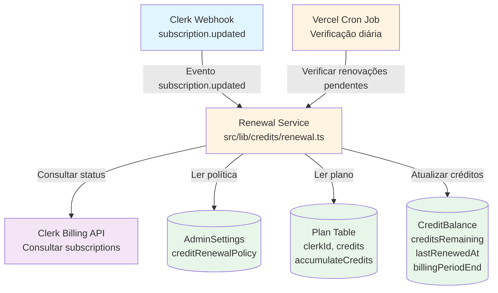

# Plano de Implementação: Melhorias no Mecanismo de Renovação Mensal de Créditos

Este plano descreve melhorias no sistema de renovação mensal de créditos para tornar o processo mais robusto, confiável e configurável. Atualmente, o sistema depende exclusivamente de webhooks do Clerk e substitui créditos ao invés de acumular, além de não ter mecanismo de fallback caso os webhooks falhem.

## Visão Geral

O sistema permitirá:
- **Rastreamento de Período de Billing**: Armazenar informações sobre quando o período de billing atual termina e quando foi a última renovação
- **Política de Acumulação Configurável**: Permitir que admins configurem se créditos não utilizados devem ser acumulados ou resetados na renovação
- **Cron Job de Fallback**: Implementar verificação periódica automática para garantir que renovações não sejam perdidas mesmo se webhooks falharem
- **Detecção Inteligente de Renovações**: Distinguir entre renovações mensais reais e simples atualizações de plano
- **Logs e Auditoria**: Registrar todas as renovações para análise e debugging

## Referências

- [Vercel Cron Jobs Documentation](https://vercel.com/docs/cron-jobs) - Documentação oficial de cron jobs na Vercel
- [Clerk Billing API](https://clerk.com/docs/billing/overview) - API do Clerk para consultar informações de billing
- Documentação do projeto: [docs/README.md](../docs/README.md)
- Guias de agents: [agents/README.md](../agents/README.md)
- [docs/backend.md](../docs/backend.md) - Padrões de API routes
- [docs/frontend.md](../docs/frontend.md) - Padrões de componentes
- [docs/database.md](../docs/database.md) - Padrões de schema Prisma
- [docs/credits.md](../docs/credits.md) - Sistema de créditos atual
- [src/lib/credits/validate-credits.ts](../src/lib/credits/validate-credits.ts) - Função refreshUserCredits atual
- [src/app/api/webhooks/clerk/route.ts](../src/app/api/webhooks/clerk/route.ts) - Webhook handler atual

## Arquitetura

**Notas sobre a arquitetura:**
- **Dual Trigger System**: O sistema usa tanto webhooks do Clerk quanto cron jobs como mecanismo de fallback, garantindo que renovações não sejam perdidas
- **Configuração Flexível**: A política de acumulação pode ser configurada globalmente (AdminSettings) ou por plano (Plan table), permitindo diferentes estratégias para diferentes planos
- **Separação de Responsabilidades**: O serviço de renovação é isolado em um módulo separado, facilitando testes e manutenção
- **Fluxo de Dados**: Webhooks e cron jobs chamam o mesmo serviço de renovação, garantindo consistência na lógica de negócio

## Pré-requisitos

1. **Conta Vercel**: Para configurar cron jobs usando Vercel Cron (ou alternativa como GitHub Actions se não usar Vercel)
2. **Clerk Billing API Token**: Token de API do Clerk com permissões para consultar subscriptions (se usar verificação via API)
3. **Variáveis de Ambiente**: Configurar `CLERK_SECRET_KEY` se ainda não estiver configurado para consultas à API do Clerk

## Passo 1: Configuração Inicial

**Agent:** [agents/backend-development.md](../agents/backend-development.md)

### 1.1 Instalar Dependências

Nenhuma dependência adicional necessária - usar pacotes existentes. O projeto já possui todas as dependências necessárias (Prisma, Clerk SDK, etc.).

### 1.2 Variáveis de Ambiente

Adicionar ao `.env` as variáveis necessárias:
- `CLERK_SECRET_KEY` (obrigatória se não existir): Chave secreta do Clerk para consultas à API de billing - Exemplo: `CLERK_SECRET_KEY="sk_live_..."`
- `CREDIT_RENEWAL_CRON_SECRET` (opcional): Secret para proteger endpoint de cron job contra chamadas não autorizadas - Exemplo: `CREDIT_RENEWAL_CRON_SECRET="random-secret-string"`

**Referência:** Seguir padrão de variáveis de ambiente conforme [docs/backend.md](../docs/backend.md). Atualizar `.env.example` se necessário.

## Passo 2: Schema do Banco de Dados

**Agent:** [agents/database-development.md](../agents/database-development.md)

### 2.1 Adicionar/Modificar Modelos no Prisma Schema

Modificar o modelo `CreditBalance` existente para adicionar campos de rastreamento:

**CreditBalance** (modificação):
- Adicionar campo `lastRenewedAt` (DateTime?): Data e hora da última renovação de créditos
- Adicionar campo `billingPeriodEnd` (DateTime?): Data e hora em que o período de billing atual termina
- Adicionar campo `nextRenewalDate` (DateTime?): Data prevista para a próxima renovação automática
- Adicionar campo `renewalCount` (Int @default(0)): Contador de quantas renovações foram processadas

**Índices:**
- `@@index([billingPeriodEnd])`: Para queries que buscam usuários com períodos de billing próximos ao fim
- `@@index([nextRenewalDate])`: Para o cron job encontrar usuários que precisam de renovação
- `@@index([lastRenewedAt])`: Para análise e auditoria de renovações

Modificar o modelo `Plan` existente para adicionar política de acumulação:

**Plan** (modificação):
- Adicionar campo `accumulateCredits` (Boolean @default(false)): Se true, créditos não utilizados são acumulados na renovação; se false, são resetados

Modificar o modelo `AdminSettings` existente para adicionar configuração global:

**AdminSettings** (modificação):
- Adicionar campo `creditRenewalPolicy` (Json?): Configuração global de política de renovação
  - Estrutura sugerida: `{ defaultAccumulate: boolean, maxAccumulatedCredits: number | null, renewalGracePeriodDays: number }`

**Padrões a seguir:**
- Usar `@default(now())` para timestamps quando apropriado
- Campos opcionais usam `?` para permitir valores nulos durante migração
- Adicionar índices em campos usados em queries frequentes
- Manter compatibilidade com dados existentes usando valores padrão apropriados

### 2.2 Executar Migração

Executar migração usando `npm run db:migrate` (interativo) ou `npm run db:push` (dev-only sync).

**Referência:** [agents/database-development.md](../agents/database-development.md) - seção "Migration"

## Passo 3: Criar Serviços (Server-Side Logic)

**Agent:** [agents/backend-development.md](../agents/backend-development.md)

### 3.1 Serviço de Renovação de Créditos

Criar `src/lib/credits/renewal.ts` (server-only):

**Função Principal:**
- Nome da função: `processCreditRenewal`
- Tipo: função assíncrona que retorna Promise com resultado da renovação
- Parâmetros esperados: `clerkUserId` (string), `planId` (string), `options` (objeto opcional com `forceRenewal`, `skipAccumulationCheck`)
- Retorno: objeto com `success` (boolean), `creditsBefore` (number), `creditsAfter` (number), `creditsAdded` (number), `renewalType` (string)

**Lógica a implementar:**
1. Buscar informações do usuário no banco de dados (CreditBalance)
2. Buscar informações do plano (Plan) para obter quantidade de créditos e política de acumulação
3. Verificar se é uma renovação real ou apenas atualização de plano (comparar `billingPeriodEnd` atual com data esperada)
4. Determinar política de acumulação: verificar primeiro `Plan.accumulateCredits`, depois `AdminSettings.creditRenewalPolicy.defaultAccumulate`
5. Se acumulação permitida: adicionar créditos do plano aos créditos existentes (respeitando limite máximo se configurado)
6. Se acumulação não permitida: substituir créditos existentes pelos créditos do plano
7. Atualizar campos de rastreamento: `lastRenewedAt`, `billingPeriodEnd`, `nextRenewalDate`, incrementar `renewalCount`
8. Criar registro em `SubscriptionEvent` para auditoria

**Tratamento de Erros:**
- Se usuário não encontrado: retornar erro específico
- Se plano não encontrado: retornar erro específico
- Se erro ao atualizar banco: fazer rollback e retornar erro
- Logar todos os erros para debugging

**Função Auxiliar:**
- Nome da função: `shouldRenewCredits`
- Tipo: função assíncrona que retorna Promise<boolean>
- Parâmetros esperados: `clerkUserId` (string), `planId` (string)
- Retorno: boolean indicando se créditos devem ser renovados
- Lógica: Verificar se `billingPeriodEnd` já passou ou está próximo (dentro de grace period), e se o plano ainda está ativo

**Função Auxiliar:**
- Nome da função: `getRenewalPolicy`
- Tipo: função assíncrona que retorna Promise com política de renovação
- Parâmetros esperados: `planId` (string)
- Retorno: objeto com `accumulate` (boolean), `maxAccumulated` (number | null), `gracePeriodDays` (number)
- Lógica: Buscar política do plano primeiro, depois buscar configuração global em AdminSettings, mesclar resultados

**Padrões:**
- Usar transações Prisma para operações multi-step
- Validar todos os inputs antes de processar
- Usar `select` para otimizar queries e evitar buscar dados desnecessários
- Logar operações importantes para auditoria

**Referência:** [docs/backend.md](../docs/backend.md) - padrões de acesso ao banco

### 3.2 Serviço de Verificação de Renovações Pendentes

Criar `src/lib/credits/renewal-check.ts` (server-only):

**Função Principal:**
- Nome da função: `checkPendingRenewals`
- Tipo: função assíncrona que retorna Promise com lista de renovações processadas
- Parâmetros esperados: `options` (objeto opcional com `limit`, `daysAhead`)
- Retorno: array de objetos com informações sobre renovações processadas

**Lógica a implementar:**
1. Buscar usuários com `nextRenewalDate` dentro do período especificado (hoje até `daysAhead` dias no futuro)
2. Para cada usuário encontrado, consultar Clerk Billing API para verificar status atual da subscription
3. Se subscription está ativa e período de billing terminou ou está próximo: chamar `processCreditRenewal`
4. Coletar resultados de todas as renovações processadas
5. Retornar resumo com contagem de sucessos e falhas

**Tratamento de Erros:**
- Se erro ao consultar Clerk API: logar e continuar com próximo usuário
- Se erro ao processar renovação individual: logar e continuar
- Retornar lista de erros junto com sucessos para análise

**Padrões:**
- Processar em batches para evitar sobrecarga
- Implementar rate limiting para chamadas à Clerk API
- Logar progresso para monitoramento

**Referência:** [docs/backend.md](../docs/backend.md) - padrões de acesso ao banco

## Passo 4: API Routes

**Agent:** [agents/backend-development.md](../agents/backend-development.md)

### 4.1 Atualizar Webhook Clerk - POST

Modificar `src/app/api/webhooks/clerk/route.ts`:

**Endpoint:** `POST /api/webhooks/clerk`

**Modificações no handler `subscription.updated`:**
1. Ao receber evento `subscription.updated` com status 'active', em vez de chamar diretamente `refreshUserCredits`, chamar `processCreditRenewal` do serviço de renovação
2. Passar `planId` e `clerkUserId` para o serviço
3. O serviço determinará se é renovação real ou apenas atualização de plano
4. Manter logging existente para compatibilidade

**Respostas:**
- `200 OK`: Webhook processado com sucesso (mesmo se renovação não foi necessária)
- `400 Bad Request`: Erro na validação do webhook
- `500 Internal Server Error`: Erro ao processar renovação

**Padrões:**
- Manter compatibilidade com código existente
- Não quebrar fluxo atual de webhooks
- Adicionar logs detalhados para debugging

**Referência:**
- [agents/backend-development.md](../agents/backend-development.md)
- [docs/backend.md](../docs/backend.md) - padrões de API routes
- Exemplo existente: `src/app/api/webhooks/clerk/route.ts`

### 4.2 Cron Job Endpoint - POST

Criar `src/app/api/cron/credit-renewal/route.ts`:

**Endpoint:** `POST /api/cron/credit-renewal`

**Autenticação:**
- Verificar header `Authorization` com valor `Bearer ${CREDIT_RENEWAL_CRON_SECRET}`
- Se secret não configurado, permitir apenas em ambiente de desenvolvimento
- Retornar 401 se não autorizado

**Validação (Zod Schema):**
- Criar schema Zod para validar query parameters opcionais
- Campo opcional `daysAhead` (number, padrão 1): Quantos dias à frente verificar renovações
- Campo opcional `limit` (number, padrão 100): Limite de usuários a processar por execução
- Usar `.strict()` para rejeitar campos desconhecidos

**Lógica:**
1. Validar autenticação via secret
2. Chamar `checkPendingRenewals` com parâmetros da query
3. Retornar resumo da execução

**Respostas:**
- `200 OK`: Cron job executado com sucesso, incluir resumo no body
- `401 Unauthorized`: Secret inválido ou ausente
- `500 Internal Server Error`: Erro ao processar renovações

**Padrões:**
- Usar `withApiLogging` wrapper para logging
- Não expor detalhes internos em erros
- Retornar estatísticas úteis para monitoramento

**Referência:**
- [agents/backend-development.md](../agents/backend-development.md)
- [docs/backend.md](../docs/backend.md) - padrões de API routes

### 4.3 Admin Endpoint para Configurar Política - POST/PUT

Criar `src/app/api/admin/credit-renewal-policy/route.ts`:

**Endpoint:** `POST /api/admin/credit-renewal-policy` ou `PUT /api/admin/credit-renewal-policy`

**Autenticação:**
- Usar `auth()` do Clerk para obter `userId`
- Validar usando `isAdmin(userId)` de `@/lib/admin-utils`
- Retornar 401 se não autorizado

**Validação (Zod Schema):**
- Criar schema Zod para validar o body da requisição
- Campos opcionais: `defaultAccumulate` (boolean), `maxAccumulatedCredits` (number | null), `renewalGracePeriodDays` (number, mínimo 0)
- Usar `.strict()` para rejeitar campos desconhecidos

**Lógica:**
1. Validar autenticação admin
2. Validar body com Zod
3. Atualizar campo `creditRenewalPolicy` em `AdminSettings`
4. Retornar configuração atualizada

**Respostas:**
- `200 OK`: Política atualizada com sucesso
- `400 Bad Request`: Erros de validação
- `401 Unauthorized`: Não é admin
- `500 Internal Server Error`: Erro ao salvar

**Padrões:**
- Seguir estrutura de API routes conforme [docs/backend.md](../docs/backend.md)
- Validar inputs com Zod usando `.strict()`
- Usar `withApiLogging` wrapper para logging

**Referência:**
- [agents/backend-development.md](../agents/backend-development.md)
- [docs/backend.md](../docs/backend.md) - padrões de API routes

## Passo 5: Interface Frontend

**Agent:** [agents/frontend-development.md](../agents/frontend-development.md)

### 5.1 Página Admin de Configuração de Renovação

Criar `src/app/(protected)/admin/settings/credit-renewal/page.tsx`:

**Rota:** `/admin/settings/credit-renewal`

**Page Metadata:**
- Título: "Configuração de Renovação de Créditos"
- Descrição: "Configure políticas de renovação mensal de créditos"
- Breadcrumbs: "Home > Admin > Settings > Credit Renewal"

**Implementação:**
- Usar `usePageConfig` hook para configurar metadata da página
- Componente deve ser Client Component ('use client')
- Layout com seção de configuração global e seção de configuração por plano

**Data Fetching:**
- Hook customizado: `useCreditRenewalPolicy()` em `src/hooks/use-credit-renewal-policy.ts`
- Query key: `['admin', 'credit-renewal-policy']`
- API endpoint: `GET /api/admin/credit-renewal-policy`

**UI Components:**
- Usar `Card`, `Label`, `Input`, `Switch`, `Button` de `src/components/ui/*`
- Formulário com react-hook-form + Zod
- Seção para configuração global (defaultAccumulate, maxAccumulatedCredits, gracePeriodDays)
- Tabela listando planos com toggle para `accumulateCredits` por plano

**Formulários:**
- Schema Zod: Validar `defaultAccumulate` (boolean), `maxAccumulatedCredits` (number | null), `renewalGracePeriodDays` (number)
- Campos: Switch para acumulação padrão, Input numérico para limite máximo, Input numérico para período de graça
- Validação: Números devem ser positivos, período de graça mínimo 0

**Padrões:**
- Seguir padrões de acessibilidade (labels, focus states)
- Usar Tailwind para estilização
- Manter componente type-safe
- Usar TanStack Query através de hooks customizados

**Referência:**
- [agents/frontend-development.md](../agents/frontend-development.md) - seção "TanStack Query Integration"
- [docs/frontend.md](../docs/frontend.md) - padrões de componentes
- Exemplo existente: `src/app/(protected)/admin/settings/page.tsx`

### 5.2 Criar Hooks Customizados

Criar `src/hooks/use-credit-renewal-policy.ts`:

**useCreditRenewalPolicy**: Hook para buscar política de renovação
- Tipo: hook de query usando TanStack Query
- Parâmetros: nenhum
- Query key: `['admin', 'credit-renewal-policy']`
- API endpoint: `GET /api/admin/credit-renewal-policy`
- Configuração de cache: staleTime 5 minutos, gcTime 10 minutos

**useUpdateCreditRenewalPolicy**: Hook para atualizar política de renovação
- Tipo: hook de mutation usando TanStack Query
- API endpoint: `PUT /api/admin/credit-renewal-policy`
- Dados esperados: objeto com `defaultAccumulate`, `maxAccumulatedCredits`, `renewalGracePeriodDays`
- Cache invalidation: invalidar query `['admin', 'credit-renewal-policy']` no onSuccess
- Toast notification: mostrar sucesso/erro

## Passo 6: Integração com Features Existentes

### 6.1 Integração com Sistema de Créditos Existente

**Modificações em `src/lib/credits/validate-credits.ts`:**
- Manter função `refreshUserCredits` existente para compatibilidade
- Adicionar comentário indicando que nova função `processCreditRenewal` deve ser usada para renovações mensais
- Função `refreshUserCredits` continua sendo usada para atualizações manuais e mudanças de plano imediatas

**Modificações em `src/lib/credits/settings.ts`:**
- Adicionar função helper para buscar política de renovação de um plano específico
- Função deve consultar `Plan.accumulateCredits` e `AdminSettings.creditRenewalPolicy`

### 6.2 Integração com Admin Settings

**Modificações em `src/app/(protected)/admin/settings/page.tsx`:**
- Adicionar link ou seção para página de configuração de renovação de créditos
- Manter estrutura existente de navegação

## Passo 7: Configuração de Cron Job

**Agent:** [agents/backend-development.md](../agents/backend-development.md)

### 7.1 Configurar Vercel Cron

Criar ou atualizar `vercel.json` na raiz do projeto:

**Configuração:**
- Adicionar configuração de cron job que chama `/api/cron/credit-renewal` diariamente
- Horário sugerido: 02:00 UTC (horário de menor tráfego)
- Incluir header `Authorization` com secret configurado

**Alternativa (GitHub Actions):**
- Se não usar Vercel, criar workflow GitHub Actions que chama o endpoint via HTTP
- Configurar secret no GitHub para autenticação
- Agendar para execução diária

**Referência:**
- [Vercel Cron Jobs Documentation](https://vercel.com/docs/cron-jobs)
- [docs/backend.md](../docs/backend.md)

## Passo 8: Testes

**Agent:** [agents/qa-agent.md](../agents/qa-agent.md)

### 8.1 Testes de Renovação de Créditos

**Cenário 1: Renovação com Acumulação Habilitada**
1. Criar usuário de teste com plano que tem `accumulateCredits = true`
2. Definir créditos atuais como 50, plano fornece 100 créditos
3. Simular renovação chamando `processCreditRenewal`
4. **Resultado esperado**: Usuário deve ter 150 créditos (50 + 100)

**Cenário 2: Renovação sem Acumulação**
1. Criar usuário de teste com plano que tem `accumulateCredits = false`
2. Definir créditos atuais como 50, plano fornece 100 créditos
3. Simular renovação chamando `processCreditRenewal`
4. **Resultado esperado**: Usuário deve ter 100 créditos (substituído)

**Cenário 3: Renovação com Limite Máximo**
1. Configurar política global com `maxAccumulatedCredits = 200`
2. Criar usuário com 180 créditos, plano fornece 100 créditos, acumulação habilitada
3. Simular renovação
4. **Resultado esperado**: Usuário deve ter 200 créditos (limitado ao máximo)

**Cenário 4: Webhook de Renovação Real**
1. Simular evento `subscription.updated` do Clerk com dados de renovação mensal
2. Verificar que `processCreditRenewal` é chamado
3. Verificar que campos `lastRenewedAt` e `billingPeriodEnd` são atualizados
4. **Resultado esperado**: Renovação processada corretamente e registrada

**Cenário 5: Cron Job de Fallback**
1. Criar usuário com `nextRenewalDate` no passado
2. Chamar endpoint `/api/cron/credit-renewal` com secret correto
3. Verificar que renovação é processada
4. **Resultado esperado**: Usuário recebe créditos renovados e `nextRenewalDate` é atualizado

### 8.2 Testes de Integração

**Teste de Fluxo Completo:**
1. Configurar plano com acumulação habilitada
2. Criar subscription ativa no Clerk (ou mock)
3. Simular webhook `subscription.updated`
4. Verificar que créditos são renovados corretamente
5. Aguardar período de billing
6. Executar cron job
7. Verificar que segunda renovação também funciona

**Referência:** [agents/qa-agent.md](../agents/qa-agent.md)

## Passo 9: Melhorias Futuras

- **Notificações de Renovação**: Enviar email ou notificação in-app quando créditos são renovados
- **Dashboard de Renovações**: Página admin mostrando estatísticas de renovações (sucessos, falhas, padrões)
- **Renovação Proativa**: Notificar usuários antes do período de billing terminar
- **Histórico Detalhado**: Tabela separada para histórico completo de renovações com mais detalhes
- **Renovação Parcial**: Suporte para renovações prorated quando usuário muda de plano no meio do período

## Checklist de Implementação

### Setup Inicial
- [ ] Verificar se `CLERK_SECRET_KEY` está configurada no `.env`
- [ ] Configurar variável de ambiente `CREDIT_RENEWAL_CRON_SECRET` no `.env`
- [ ] Atualizar `.env.example` com novas variáveis

### Banco de Dados
- [ ] Adicionar campo `lastRenewedAt` ao modelo `CreditBalance`
- [ ] Adicionar campo `billingPeriodEnd` ao modelo `CreditBalance`
- [ ] Adicionar campo `nextRenewalDate` ao modelo `CreditBalance`
- [ ] Adicionar campo `renewalCount` ao modelo `CreditBalance`
- [ ] Adicionar campo `accumulateCredits` ao modelo `Plan`
- [ ] Adicionar campo `creditRenewalPolicy` ao modelo `AdminSettings`
- [ ] Adicionar índice `@@index([billingPeriodEnd])` em `CreditBalance`
- [ ] Adicionar índice `@@index([nextRenewalDate])` em `CreditBalance`
- [ ] Adicionar índice `@@index([lastRenewedAt])` em `CreditBalance`
- [ ] Executar migração (`npm run db:migrate`)
- [ ] Verificar que migration foi aplicada corretamente

### Serviços (Server-Side)
- [ ] Criar arquivo `src/lib/credits/renewal.ts`
- [ ] Implementar função `processCreditRenewal`
- [ ] Implementar função `shouldRenewCredits`
- [ ] Implementar função `getRenewalPolicy`
- [ ] Criar arquivo `src/lib/credits/renewal-check.ts`
- [ ] Implementar função `checkPendingRenewals`
- [ ] Adicionar tratamento de erros em todas as funções
- [ ] Testar serviços isoladamente

### API Routes
- [ ] Modificar `src/app/api/webhooks/clerk/route.ts` para usar `processCreditRenewal`
- [ ] Criar arquivo `src/app/api/cron/credit-renewal/route.ts`
- [ ] Implementar autenticação via secret no cron endpoint
- [ ] Implementar validação Zod no cron endpoint
- [ ] Criar arquivo `src/app/api/admin/credit-renewal-policy/route.ts`
- [ ] Implementar método GET `/api/admin/credit-renewal-policy`
- [ ] Implementar método PUT `/api/admin/credit-renewal-policy`
- [ ] Adicionar validação Zod com `.strict()` em todas as rotas
- [ ] Adicionar autenticação apropriada em todas as rotas
- [ ] Adicionar `withApiLogging` wrapper em todas as rotas
- [ ] Testar cada rota individualmente

### Frontend
- [ ] Criar hook `src/hooks/use-credit-renewal-policy.ts`
- [ ] Implementar `useCreditRenewalPolicy` hook
- [ ] Implementar `useUpdateCreditRenewalPolicy` hook
- [ ] Criar página `src/app/(protected)/admin/settings/credit-renewal/page.tsx`
- [ ] Implementar Page Metadata System na página
- [ ] Adicionar componentes UI necessários (Card, Switch, Input, Button)
- [ ] Implementar formulário com react-hook-form + Zod
- [ ] Adicionar seção de configuração global
- [ ] Adicionar seção de configuração por plano
- [ ] Adicionar navegação na página de admin settings
- [ ] Testar UI em diferentes tamanhos de tela

### Integração
- [ ] Atualizar `src/lib/credits/validate-credits.ts` com comentários sobre nova função
- [ ] Adicionar função helper em `src/lib/credits/settings.ts` para buscar política
- [ ] Atualizar `src/app/(protected)/admin/settings/page.tsx` com link para nova página
- [ ] Verificar que webhooks existentes continuam funcionando

### Cron Job
- [ ] Criar ou atualizar `vercel.json` com configuração de cron
- [ ] Configurar horário de execução (02:00 UTC sugerido)
- [ ] Testar endpoint de cron manualmente
- [ ] Verificar logs após primeira execução automática

### Qualidade
- [ ] Executar `npm run lint` e corrigir TODOS os erros
- [ ] Executar `npm run typecheck` e corrigir TODOS os erros
- [ ] Executar `npm run build` e verificar que compila sem erros
- [ ] Testar renovação com acumulação habilitada
- [ ] Testar renovação sem acumulação
- [ ] Testar renovação com limite máximo
- [ ] Testar webhook de renovação real
- [ ] Testar cron job de fallback
- [ ] Verificar logs de API (`withApiLogging`)
- [ ] Revisar segurança conforme [agents/security-check.md](../agents/security-check.md)
- [ ] Verificar acessibilidade (labels, focus, keyboard nav)
- [ ] Testar em diferentes navegadores (se aplicável)

## Notas Importantes

1. **Compatibilidade Retroativa**: A função `refreshUserCredits` existente deve continuar funcionando para não quebrar código existente. A nova função `processCreditRenewal` é uma adição, não uma substituição completa.

2. **Performance do Cron Job**: O cron job deve processar usuários em batches para evitar timeouts. Considerar processar no máximo 100-200 usuários por execução.

3. **Rate Limiting**: Ao consultar Clerk Billing API, implementar rate limiting para evitar exceder limites da API. Considerar cache de resultados quando apropriado.

4. **Grace Period**: O período de graça (grace period) permite que renovações sejam processadas alguns dias antes ou depois da data exata, evitando problemas de timing.

5. **Segurança do Cron Endpoint**: O endpoint de cron deve sempre verificar o secret, mesmo em desenvolvimento. Nunca expor o endpoint publicamente sem autenticação.

6. **Logs e Auditoria**: Todas as renovações devem ser registradas em `SubscriptionEvent` para auditoria e debugging. Incluir informações sobre tipo de renovação (webhook vs cron) e política aplicada.

7. **Migração de Dados Existentes**: Usuários existentes não terão `billingPeriodEnd` e `nextRenewalDate` preenchidos inicialmente. O sistema deve lidar graciosamente com valores nulos e preencher na primeira renovação.

8. **Configuração por Plano vs Global**: A política de acumulação no nível do plano tem precedência sobre a configuração global. Isso permite diferentes estratégias para diferentes tipos de planos (ex: planos básicos resetam, planos premium acumulam).

## Referências de Documentação

- **Agents:**
  - [agents/database-development.md](../agents/database-development.md) - Schema e migrações
  - [agents/backend-development.md](../agents/backend-development.md) - API routes e serviços
  - [agents/frontend-development.md](../agents/frontend-development.md) - UI e componentes
  - [agents/qa-agent.md](../agents/qa-agent.md) - Testes
  - [agents/security-check.md](../agents/security-check.md) - Revisão de segurança

- **Documentação:**
  - [docs/backend.md](../docs/backend.md) - Padrões de API
  - [docs/frontend.md](../docs/frontend.md) - Padrões de frontend
  - [docs/database.md](../docs/database.md) - Padrões de banco
  - [docs/credits.md](../docs/credits.md) - Sistema de créditos
  - [docs/development-guidelines.md](../docs/development-guidelines.md) - Diretrizes gerais
  - [docs/api.md](../docs/api.md) - Documentação de APIs

- **Código de Referência:**
  - `src/app/api/webhooks/clerk/route.ts` - Webhook handler existente
  - `src/lib/credits/validate-credits.ts` - Função refreshUserCredits atual
  - `src/lib/credits/settings.ts` - Configuração de créditos
  - `src/app/(protected)/admin/settings/page.tsx` - Página de settings admin existente
  - `src/app/api/admin/users/sync/route.ts` - Exemplo de endpoint admin

---

## Validação Final para Agentes de IA

Antes de considerar o plano completo, verifique:

- [x] Todos os marcadores `[NOME]`, `[DESCREVER]`, `[ADICIONAR]` foram substituídos
- [x] Todas as referências aos agents estão corretas e específicas
- [x] Todos os caminhos de arquivos estão corretos
- [x] O diagrama Mermaid está correto e renderiza
- [x] O checklist está completo e específico
- [x] Todas as seções não aplicáveis foram removidas
- [x] Nenhum código foi incluído no plano - apenas orientações descritivas
- [x] Referências à documentação estão completas
- [x] Instruções são claras e acionáveis

