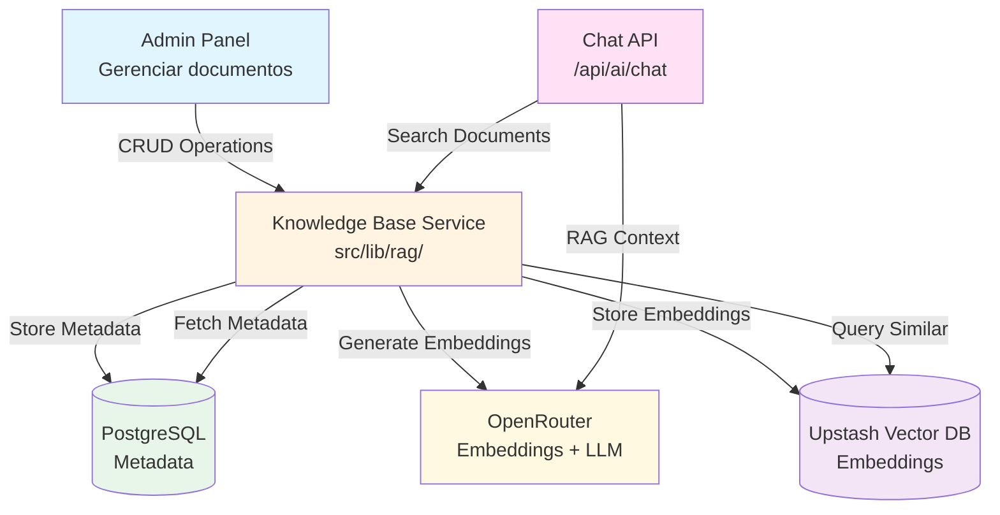

# Plano de Implementação: RAG com Upstash Vector DB

Este plano descreve como implementar um sistema RAG (Retrieval-Augmented Generation) usando Upstash Vector DB integrado ao chat existente e gerenciável via painel admin.

## Visão Geral

O sistema permitirá:
- **Knowledge Base**: Armazenar documentos e textos que serão convertidos em embeddings e indexados no Upstash Vector
- **RAG no Chat**: Quando o usuário fizer uma pergunta, o sistema buscará documentos relevantes no Vector DB e os incluirá como contexto para o LLM
- **Admin Panel**: Interface para gerenciar documentos da knowledge base (adicionar, editar, deletar, visualizar)

## Referências

- [Upstash Vector Documentation](https://upstash.com/docs/vector/sdks/ts/getting-started)
- [Upstash Console](https://console.upstash.com/)
- [OpenRouter Models - Embeddings](https://openrouter.ai/models?fmt=cards&output_modalities=embeddings) - Lista de modelos de embedding disponíveis no OpenRouter
- Documentação do projeto: [docs/README.md](../docs/README.md)
- Guias de agents: [agents/README.md](../agents/README.md)

## Arquitetura

## Pré-requisitos

1. Conta no Upstash (gratuita)
2. Criar um Vector Index no console do Upstash
3. Obter `UPSTASH_VECTOR_REST_URL` e `UPSTASH_VECTOR_REST_TOKEN`
4. Ter `OPENROUTER_API_KEY` configurada (já existente no projeto para uso com modelos de chat)

## Passo 1: Configuração Inicial

### 1.1 Instalar Dependências

Instalar o SDK do Upstash Vector. Para embeddings, usar OpenRouter que já está configurado no projeto.

**Dependências necessárias:**
- `@upstash/vector`: SDK oficial do Upstash Vector

**Nota:** O projeto já possui OpenRouter configurado (`OPENROUTER_API_KEY`), que será usado para gerar embeddings através do modelo `openai/text-embedding-3-large` ou similar disponível no OpenRouter. Não é necessário instalar SDK adicional de OpenAI.

### 1.2 Variáveis de Ambiente

Adicionar ao `.env` as variáveis necessárias:
- `UPSTASH_VECTOR_REST_URL`: URL do seu Vector Index no Upstash
- `UPSTASH_VECTOR_REST_TOKEN`: Token de autenticação do Upstash

**Nota:** A variável `OPENROUTER_API_KEY` já deve estar configurada no projeto (usada para o chat). Ela será reutilizada para gerar embeddings através do OpenRouter usando modelos de embedding da OpenAI.

**Referência:** Seguir padrão de variáveis de ambiente conforme [docs/backend.md](../docs/backend.md). Atualizar `.env.example` se necessário.

## Passo 2: Schema do Banco de Dados

**Agent:** [agents/database-development.md](../agents/database-development.md)

### 2.1 Adicionar Modelos ao Prisma Schema

Criar dois novos modelos no `prisma/schema.prisma`:

**KnowledgeDocument**: Armazena metadados dos documentos
- Campos básicos: `id` (cuid), `title` (String), `content` (String @db.Text)
- Organização: `category` (String?, opcional), `tags` (String[]), `metadata` (Json?)
- Controle: `isActive` (Boolean @default(true)), `createdAt`, `updatedAt`, `createdBy` (String?, Clerk user ID)
- Relação com Vector: `vectorId` (String?, referência ao ID no Upstash)
- Relação: `documentChunks` (DocumentChunk[])
- Índices: `@@index([category])`, `@@index([isActive])`, `@@index([createdAt])`, `@@index([vectorId])`

**DocumentChunk**: Para documentos grandes que precisam ser divididos
- Campos: `id` (cuid), `documentId` (String, FK), `content` (String @db.Text), `chunkIndex` (Int), `vectorId` (String?)
- Relação: `document` (KnowledgeDocument) com `onDelete: Cascade`
- Índices: `@@index([documentId])`, `@@index([vectorId])`
- Unique constraint: `@@unique([documentId, chunkIndex])`
- Timestamp: `createdAt` (DateTime @default(now()))

**Padrões a seguir:**
- Usar `@default(cuid())` para IDs
- Usar `@default(now())` e `@updatedAt` para timestamps
- Definir `onDelete: Cascade` na relação DocumentChunk → KnowledgeDocument
- Adicionar índices em campos frequentemente filtrados

### 2.2 Executar Migração

Executar migração usando `npm run db:migrate` (interativo) ou `npm run db:push` (dev-only sync).

**Referência:** [agents/database-development.md](../agents/database-development.md) - seção "Migration"

## Passo 3: Criar Serviços (Server-Side Logic)

**Agent:** [agents/backend-development.md](../agents/backend-development.md)

**Importante:** Todos os serviços devem ser criados em arquivos server-only (sem 'use client'). Manter acesso ao banco de dados centralizado.

### 3.1 Serviço de Embeddings

Criar `src/lib/rag/embeddings.ts` (server-only):

**generateTextEmbedding**: Recebe um texto e retorna um array de números (embedding)
- Usar OpenRouter para gerar embeddings através do modelo `openai/text-embedding-3-large` (ou outro modelo de embedding disponível no OpenRouter)
- Usar a função `generateEmbedding` do AI SDK (`ai`) com o provider OpenRouter já configurado no projeto
- Reutilizar a configuração existente do OpenRouter (mesma usada no chat)
- Retornar `Promise<number[]>`

**chunkText**: Divide textos grandes em chunks menores
- Parâmetros: `text` (string), `chunkSize` (number, padrão 1000), `overlap` (number, padrão 200)
- Retorna `string[]` (array de chunks)
- Implementar lógica de sobreposição para manter contexto entre chunks
- Considerar limites de tokens do modelo de embedding

**Padrões:**
- Manter funções puras quando possível
- Tratar erros adequadamente (falhas na API de embeddings)
- Não expor chaves de API

### 3.2 Serviço Upstash Vector

Criar `src/lib/rag/vector-store.ts` (server-only):

**Tipo DocumentMetadata**: Interface TypeScript para metadata dos documentos
- Campos: `documentId` (string), `title` (string), `category?` (string), `tags?` (string[]), `chunkIndex?` (number), `createdAt` (string, ISO)

**Inicializar cliente**: Criar instância do `Index<DocumentMetadata>` do Upstash Vector
- Usar variáveis de ambiente: `process.env.UPSTASH_VECTOR_REST_URL` e `process.env.UPSTASH_VECTOR_REST_TOKEN`
- Validar presença das variáveis

**upsertVector**: Adicionar ou atualizar um vetor no Upstash
- Parâmetros: `id` (string), `vector` (number[]), `metadata` (DocumentMetadata)
- Retornar resultado do `vectorIndex.upsert()`

**querySimilarVectors**: Buscar vetores similares a uma query
- Parâmetros: `queryVector` (number[]), `topK` (number, padrão 5), `filter?` (Record<string, unknown>)
- Retornar com `includeMetadata: true`
- Tratar erros de conexão/limites

**deleteVector**: Remover um vetor por ID
- Parâmetros: `id` (string)
- Usar `vectorIndex.delete([id])`

**fetchVectors**: Buscar vetores por IDs específicos
- Parâmetros: `ids` (string[])
- Retornar resultados com metadata

**Padrões:**
- Validar inputs antes de chamar Upstash
- Tratar erros de rate limiting e conexão
- Não expor tokens do Upstash

### 3.3 Serviço de Knowledge Base

Criar `src/lib/rag/knowledge-base.ts` (server-only):

**addDocument**: Adicionar novo documento
1. Validar parâmetros de entrada
2. Criar registro no PostgreSQL usando Prisma (`db.knowledgeDocument.create`)
3. Verificar tamanho do conteúdo para decidir chunking:
   - Se pequeno: gerar um único embedding e indexar no Vector DB
   - Se grande: dividir em chunks usando `chunkText`, gerar embedding para cada chunk, indexar todos
4. Salvar referência do `vectorId` no banco (ou múltiplos IDs para chunks)
5. Para documentos grandes, criar registros em `DocumentChunk` usando `createMany`
6. Usar transação Prisma se necessário para garantir consistência
7. Retornar documento criado

**updateDocument**: Atualizar documento existente
1. Buscar documento existente no banco
2. Validar que existe
3. Verificar se o conteúdo mudou
4. Se mudou:
   - Deletar vetores antigos do Upstash (usar `deleteVector`)
   - Deletar chunks do banco (`db.documentChunk.deleteMany`)
   - Reindexar com novo conteúdo (mesma lógica do `addDocument`)
5. Atualizar metadados no PostgreSQL (`db.knowledgeDocument.update`)
6. Retornar documento atualizado

**deleteDocument**: Deletar documento
1. Buscar documento e seus chunks no banco
2. Validar que existe
3. Deletar todos os vetores relacionados no Upstash
4. Deletar registro no PostgreSQL (cascade deleta chunks automaticamente)
5. Retornar sucesso

**searchDocuments**: Buscar documentos relevantes
1. Gerar embedding da query do usuário usando `generateTextEmbedding`
2. Buscar no Vector DB usando `querySimilarVectors` (topK: 5 por padrão)
3. Extrair IDs únicos dos documentos encontrados dos resultados
4. Buscar documentos completos no PostgreSQL usando `db.knowledgeDocument.findMany` (apenas `isActive: true`)
5. Combinar resultados do Vector DB com dados do PostgreSQL
6. Retornar resultados ordenados por relevância (score do Vector DB)

**Padrões:**
- Usar Prisma com `select`/`include` para otimizar queries
- Tratar erros de forma adequada (documento não encontrado, falhas no Vector DB)
- Manter consistência entre PostgreSQL e Upstash
- Considerar usar transações para operações multi-step

**Referência:** [docs/backend.md](../docs/backend.md) - padrões de acesso ao banco

## Passo 4: Modificar Chat API para RAG

**Agent:** [agents/backend-development.md](../agents/backend-development.md)

### 4.1 Atualizar `src/app/api/ai/chat/route.ts`

Seguir padrões existentes do arquivo e adicionar suporte a RAG:

1. **Importar dependências:**
   - Importar `searchDocuments` do serviço de knowledge base (`@/lib/rag/knowledge-base`)

2. **Atualizar BodySchema (Zod):**
   - Adicionar campo `useRAG` (z.boolean().optional().default(false)) ao schema existente
   - Manter validação `.strict()` para rejeitar campos desconhecidos

3. **Lógica RAG (antes de chamar `streamText`):**
   - Se `parsed.data.useRAG` for true:
     - Extrair a última mensagem do usuário do array `messages`
     - Extrair texto da mensagem (filtrar partes do tipo 'text')
     - Chamar `searchDocuments` com a query do usuário (topK: 3)
     - Construir contexto RAG formatado com os documentos encontrados
     - Incluir instruções claras para o LLM usar o contexto
   - Se não houver contexto RAG ou `useRAG` for false, usar mensagem de sistema padrão

4. **Adicionar mensagem de sistema:**
   - Criar mensagem de sistema com o contexto RAG antes das mensagens do usuário
   - Inserir no início do array `modelMessages` antes de `convertToModelMessages`

5. **Créditos:**
   - Se implementar custo diferenciado para RAG, usar feature key `ai_text_chat_rag` quando `useRAG` for true
   - Manter `ai_text_chat` para chat sem RAG
   - Seguir padrão: `validateCreditsForFeature` → `deductCreditsForFeature`
   - Ver [agents/backend-development.md](../agents/backend-development.md) - seção "Credits for AI usage"

**Padrões a seguir:**
- Manter estrutura existente do arquivo
- Usar `withApiLogging` wrapper (já existe)
- Validar inputs com Zod
- Tratar erros adequadamente (falhas na busca RAG não devem quebrar o chat)
- Não vazar informações internas em mensagens de erro

**Referência:** 
- [agents/backend-development.md](../agents/backend-development.md)
- [docs/backend.md](../docs/backend.md) - padrões de API routes
- Arquivo existente: `src/app/api/ai/chat/route.ts`

## Passo 5: API Routes para Admin

**Agent:** [agents/backend-development.md](../agents/backend-development.md)

### 5.1 Listar Documentos

Criar `src/app/api/admin/knowledge/route.ts` com método GET:

**Autenticação:**
- Usar `auth()` do Clerk para obter `userId`
- Validar admin usando `isAdmin(userId)` de `@/lib/admin-utils`
- Retornar 401 se não autorizado

**Query:**
- Buscar documentos usando `db.knowledgeDocument.findMany`
- Ordenar por `createdAt: 'desc'` (mais recentes primeiro)
- Incluir contagem de chunks usando `_count: { select: { documentChunks: true } }`
- Filtrar apenas documentos ativos (`isActive: true`) se necessário

**Resposta:**
- Retornar `NextResponse.json({ documents })`
- Usar `withApiLogging` wrapper para logging

**Padrões:**
- Seguir estrutura de API routes conforme [docs/backend.md](../docs/backend.md)
- Usar `select`/`include` para otimizar queries
- Tratar erros adequadamente

### 5.2 Criar Documento

Adicionar método POST na mesma rota (`src/app/api/admin/knowledge/route.ts`):

**Autenticação:**
- Validar admin usando `isAdmin(userId)`

**Validação:**
- Criar schema Zod para body: `title` (string min 1), `content` (string min 1), `category?` (string opcional), `tags?` (array de strings), `metadata?` (object opcional)
- Validar com `.strict()` para rejeitar campos desconhecidos
- Retornar 400 com detalhes de validação se inválido

**Lógica:**
- Chamar `addDocument` do serviço de knowledge base (`@/lib/rag/knowledge-base`)
- Passar `createdBy: userId` (Clerk user ID)
- Tratar erros do serviço (falhas na indexação, etc.)

**Resposta:**
- Retornar `NextResponse.json({ document }, { status: 201 })` em caso de sucesso
- Retornar erro apropriado em caso de falha

**Padrões:**
- Seguir padrão de validação Zod conforme [agents/backend-development.md](../agents/backend-development.md)
- Não vazar detalhes internos em erros

### 5.3 Atualizar e Deletar Documento

Criar `src/app/api/admin/knowledge/[id]/route.ts`:

**PUT - Atualizar documento:**
- Validar admin
- Criar schema Zod para body (campos opcionais: `title?`, `content?`, `category?`, `tags?`, `metadata?`)
- Validar que o documento existe
- Chamar `updateDocument` do serviço
- Retornar documento atualizado ou erro apropriado

**DELETE - Deletar documento:**
- Validar admin
- Validar que o documento existe
- Chamar `deleteDocument` do serviço
- Retornar `{ success: true }` ou erro apropriado

**Padrões:**
- Usar `withApiLogging` wrapper
- Retornar 404 se documento não encontrado
- Retornar 500 para erros internos sem vazar detalhes

**Referência:**
- [agents/backend-development.md](../agents/backend-development.md) - seção "Steps"
- [docs/backend.md](../docs/backend.md) - padrões de API routes
- Exemplo existente: `src/app/api/admin/settings/route.ts`

## Passo 6: Interface Admin

**Agent:** [agents/frontend-development.md](../agents/frontend-development.md)

### 6.1 Página de Knowledge Base

Criar `src/app/admin/knowledge/page.tsx`:

**Page Metadata:**
- Usar `usePageConfig` hook para configurar título, descrição e breadcrumbs
- Título: "Knowledge Base"
- Breadcrumbs: Admin → Knowledge Base

**Data Fetching:**
- **NÃO usar `fetch()` diretamente**
- Criar hook customizado `useKnowledgeDocuments()` em `src/hooks/use-knowledge-documents.ts`
- Hook deve usar TanStack Query com `useQuery`
- Query key: `['admin', 'knowledge', 'documents']`
- Chamar API através de `api.get('/api/admin/knowledge')` do `@/lib/api-client`
- Configurar `staleTime` e `gcTime` apropriados

**UI Components:**
- Usar componentes existentes de `src/components/ui/*`:
  - `Card`, `CardHeader`, `CardTitle`, `CardContent` para listar documentos
  - `Dialog`, `DialogContent`, `DialogHeader`, `DialogTitle`, `DialogTrigger` para modal de criação
  - `Button` para ações
  - `Input`, `Textarea` para formulário
- Listar documentos em cards com:
  - Título
  - Categoria e tags (se existirem)
  - Preview do conteúdo (primeiros 200 caracteres)
  - Botão de deletar

**Formulário:**
- Usar `react-hook-form` com Zod resolver
- Campos: título (obrigatório), conteúdo (obrigatório), categoria (opcional), tags (opcional, separadas por vírgula)
- Validação client-side com feedback inline
- Mostrar erros de servidor de forma não verbosa

**Mutations:**
- Criar hook `useCreateKnowledgeDocument()` para criação
- Criar hook `useDeleteKnowledgeDocument()` para deleção
- Ambos devem usar `useMutation` do TanStack Query
- Invalidar query `['admin', 'knowledge', 'documents']` após mutações bem-sucedidas
- Mostrar toast de sucesso/erro usando `useToast`

**Padrões:**
- Seguir padrões de acessibilidade (labels, focus states)
- Usar Tailwind para estilização
- Manter componente type-safe
- Não importar Prisma ou acessar banco diretamente

**Referência:**
- [agents/frontend-development.md](../agents/frontend-development.md) - seção "TanStack Query Integration"
- [docs/frontend.md](../docs/frontend.md) - padrões de componentes
- Exemplo existente: `src/app/admin/settings/page.tsx`

### 6.2 Criar Hooks Customizados

Criar `src/hooks/use-knowledge-documents.ts`:

**useKnowledgeDocuments**: Hook para buscar documentos
- Usar `useQuery` com query key `['admin', 'knowledge', 'documents']`
- Chamar `api.get('/api/admin/knowledge')`
- Retornar dados tipados

**useCreateKnowledgeDocument**: Hook para criar documento
- Usar `useMutation`
- Chamar `api.post('/api/admin/knowledge', data)`
- Invalidar `['admin', 'knowledge', 'documents']` no `onSuccess`
- Mostrar toast de sucesso/erro

**useUpdateKnowledgeDocument**: Hook para atualizar documento
- Similar ao create, mas com `api.put`

**useDeleteKnowledgeDocument**: Hook para deletar documento
- Similar, mas com `api.delete`

**Padrões:**
- Seguir estrutura de hooks existentes (ex: `src/hooks/use-admin-settings.ts`)
- Tipar interfaces de request/response
- Configurar cache apropriadamente

### 6.3 Adicionar Link no Admin Sidebar

Atualizar `src/components/admin/admin-sidebar.tsx`:

- Adicionar novo item no array de navegação
- Título: "Knowledge Base"
- URL: `/admin/knowledge`
- Ícone apropriado (importar de `lucide-react`, ex: `BookOpen`)

**Referência:** Estrutura existente do arquivo

## Passo 7: Atualizar Chat UI

**Agent:** [agents/frontend-development.md](../agents/frontend-development.md)

### 7.1 Adicionar Toggle RAG

Atualizar `src/app/(protected)/ai-chat/page.tsx`:

**Estado:**
- Adicionar estado `useRAG` (boolean) usando `useState`
- Inicializar como `false`

**UI:**
- Adicionar checkbox ou switch na interface (usar componente `Checkbox` ou `Switch` de `src/components/ui`)
- Label: "Usar Knowledge Base (RAG)"
- Posicionar próximo aos controles de modelo/provedor

**Integração com useChat:**
- Passar `useRAG` no objeto `body` da configuração do `useChat`
- O hook `useChat` enviará automaticamente o valor no body da requisição
- Exemplo: `body: { useRAG }` (juntamente com outros campos existentes)

**UX:**
- Mostrar indicador visual quando RAG estiver ativo
- Considerar desabilitar durante streaming
- Manter estado persistido durante a sessão

**Padrões:**
- Seguir padrões de acessibilidade
- Manter consistência visual com o resto da interface
- Não quebrar funcionalidade existente

**Referência:**
- [agents/frontend-development.md](../agents/frontend-development.md) - seção "AI Chat"
- Arquivo existente: `src/app/(protected)/ai-chat/page.tsx`

## Passo 8: Configuração de Créditos (Opcional)

**Agent:** [agents/backend-development.md](../agents/backend-development.md)

Se quiser diferenciar custos entre chat normal e chat com RAG:

### 8.1 Adicionar Feature Key

Atualizar `src/lib/credits/feature-config.ts`:
- Adicionar novo feature key `ai_text_chat_rag` ao objeto `FEATURE_CREDIT_COSTS`
- Definir custo (ex: 2 créditos vs 1 do chat normal)
- Garantir que o tipo `FeatureKey` inclua a nova chave

### 8.2 Atualizar Enum OperationType

Atualizar `prisma/schema.prisma`:
- Adicionar `AI_TEXT_CHAT_RAG` ao enum `OperationType`
- Executar migração

### 8.3 Atualizar Chat API

Na API de chat (`src/app/api/ai/chat/route.ts`):
- Usar `ai_text_chat_rag` como feature key quando `useRAG` for true
- Manter `ai_text_chat` para chat sem RAG
- Seguir padrão: `validateCreditsForFeature` → `deductCreditsForFeature`

**Padrões:**
- Tipar feature key como `FeatureKey`
- Seguir padrão de créditos conforme [agents/backend-development.md](../agents/backend-development.md) - seção "Credits & Billing"

**Referência:**
- [docs/credits.md](../docs/credits.md)
- [src/lib/credits/feature-config.ts](../src/lib/credits/feature-config.ts)

## Passo 9: Testes

**Agent:** [agents/qa-agent.md](../agents/qa-agent.md)

### 9.1 Testar Knowledge Base

1. **Criar documento via admin:**
   - Acessar `/admin/knowledge`
   - Criar documento de teste com título e conteúdo
   - Verificar se aparece na lista

2. **Verificar indexação:**
   - Verificar no console do Upstash se o vetor foi criado
   - Verificar no banco PostgreSQL se o registro foi criado corretamente

3. **Testar busca:**
   - Testar busca de documentos similares usando o serviço diretamente (ou criar endpoint de teste)

### 9.2 Testar RAG no Chat

1. **Preparação:**
   - Criar documento na knowledge base com informações conhecidas e específicas

2. **Teste com RAG:**
   - Abrir chat (`/ai-chat`)
   - Ativar toggle RAG
   - Fazer pergunta relacionada ao conteúdo do documento
   - Verificar se a resposta do LLM inclui informações do documento

3. **Teste sem RAG:**
   - Desativar RAG
   - Fazer mesma pergunta
   - Comparar resposta (deve ser diferente, sem contexto específico)

4. **Teste de erros:**
   - Testar comportamento quando não há documentos na knowledge base
   - Testar comportamento quando a busca não retorna resultados relevantes

**Referência:** [agents/qa-agent.md](../agents/qa-agent.md)

## Passo 10: Melhorias Futuras

- **Upload de arquivos**: Permitir upload de PDFs, DOCX, TXT, etc. e processar automaticamente
- **Processamento assíncrono**: Para documentos grandes, usar fila de jobs (ex: QStash do Upstash)
- **Métricas**: Rastrear quais documentos são mais consultados e úteis
- **Filtros avançados**: Permitir filtrar busca por categoria/tags no RAG
- **Preview de contexto**: Mostrar ao usuário quais documentos foram usados no contexto
- **Versionamento**: Manter histórico de alterações nos documentos
- **Busca híbrida**: Combinar busca semântica (vector) com busca textual (full-text search do PostgreSQL)
- **Re-ranking**: Usar modelo de re-ranking para melhorar resultados

## Checklist de Implementação

### Setup Inicial
- [ ] Instalar dependência `@upstash/vector`
- [ ] Verificar que `OPENROUTER_API_KEY` está configurada (já deve existir no projeto para uso com chat)
- [ ] Configurar variáveis de ambiente `UPSTASH_VECTOR_REST_URL` e `UPSTASH_VECTOR_REST_TOKEN` no `.env`
- [ ] Atualizar `.env.example` com novas variáveis do Upstash (se necessário)

### Banco de Dados
- [ ] Adicionar modelos `KnowledgeDocument` e `DocumentChunk` ao Prisma schema
- [ ] Adicionar índices apropriados
- [ ] Executar migração do banco de dados (`npm run db:migrate`)
- [ ] Verificar que migration foi aplicada corretamente

### Serviços (Server-Side)
- [ ] Criar serviço de embeddings (`src/lib/rag/embeddings.ts`) usando OpenRouter
- [ ] Criar serviço Upstash Vector (`src/lib/rag/vector-store.ts`)
- [ ] Criar serviço Knowledge Base (`src/lib/rag/knowledge-base.ts`)
- [ ] Testar serviços isoladamente

### API Routes
- [ ] Modificar Chat API (`src/app/api/ai/chat/route.ts`) para suportar RAG
- [ ] Criar API route GET `/api/admin/knowledge`
- [ ] Criar API route POST `/api/admin/knowledge`
- [ ] Criar API route PUT `/api/admin/knowledge/[id]`
- [ ] Criar API route DELETE `/api/admin/knowledge/[id]`
- [ ] Adicionar `withApiLogging` em todas as rotas
- [ ] Validar autenticação admin em rotas admin

### Frontend
- [ ] Criar hooks customizados (`src/hooks/use-knowledge-documents.ts`)
- [ ] Criar página admin de Knowledge Base (`src/app/admin/knowledge/page.tsx`)
- [ ] Implementar Page Metadata System na página admin
- [ ] Adicionar link "Knowledge Base" no admin sidebar
- [ ] Adicionar toggle RAG no chat UI (`src/app/(protected)/ai-chat/page.tsx`)

### Créditos (Opcional)
- [ ] Adicionar feature key `ai_text_chat_rag` em `feature-config.ts`
- [ ] Adicionar enum `AI_TEXT_CHAT_RAG` ao `OperationType`
- [ ] Atualizar Chat API para usar feature key diferenciada

### Qualidade
- [ ] Executar `npm run lint` e corrigir erros
- [ ] Executar `npm run typecheck` e corrigir erros
- [ ] Executar `npm run build` e verificar que compila
- [ ] Testar criação de documentos via admin
- [ ] Testar busca e RAG no chat
- [ ] Verificar logs de API (`withApiLogging`)

## Notas Importantes

1. **Custos**: Upstash Vector tem plano gratuito generoso, mas monitore o uso conforme escala
2. **Embeddings**: Usar OpenRouter com modelo `openai/text-embedding-3-large` (ou outro modelo de embedding disponível no OpenRouter). A mesma `OPENROUTER_API_KEY` usada para o chat será reutilizada.
3. **Chunking**: Ajuste `chunkSize` e `overlap` conforme necessário - valores muito pequenos podem perder contexto, muito grandes podem ser ineficientes
4. **Performance**: Para muitos documentos ou documentos muito grandes, considere processamento assíncrono
5. **Segurança**: Valide e sanitize todos os inputs antes de indexar no Vector DB
6. **Limites**: Verifique limites de tamanho do Upstash Vector e ajuste chunking se necessário
7. **Metadata**: Use metadata do Vector DB para filtros e organização, mas mantenha dados completos no PostgreSQL
8. **Erros**: Implemente tratamento de erros robusto, especialmente para falhas na geração de embeddings ou indexação
9. **Consistência**: Garanta consistência entre PostgreSQL (metadados) e Upstash Vector (embeddings)
10. **Tenancy**: Se implementar multi-tenancy no futuro, considerar filtros por workspace/user no Vector DB

## Referências de Documentação

- **Agents:**
  - [agents/database-development.md](../agents/database-development.md) - Schema e migrações
  - [agents/backend-development.md](../agents/backend-development.md) - API routes e serviços
  - [agents/frontend-development.md](../agents/frontend-development.md) - UI e componentes
  - [agents/qa-agent.md](../agents/qa-agent.md) - Testes

- **Documentação:**
  - [docs/backend.md](../docs/backend.md) - Padrões de API
  - [docs/frontend.md](../docs/frontend.md) - Padrões de frontend
  - [docs/database.md](../docs/database.md) - Padrões de banco
  - [docs/credits.md](../docs/credits.md) - Sistema de créditos
  - [docs/development-guidelines.md](../docs/development-guidelines.md) - Diretrizes gerais

- **Código de Referência:**
  - `src/app/api/ai/chat/route.ts` - Exemplo de API de chat
  - `src/app/api/admin/settings/route.ts` - Exemplo de API admin
  - `src/app/admin/settings/page.tsx` - Exemplo de página admin
  - `src/hooks/use-admin-settings.ts` - Exemplo de hooks customizados
  - `src/lib/credits/feature-config.ts` - Configuração de créditos
